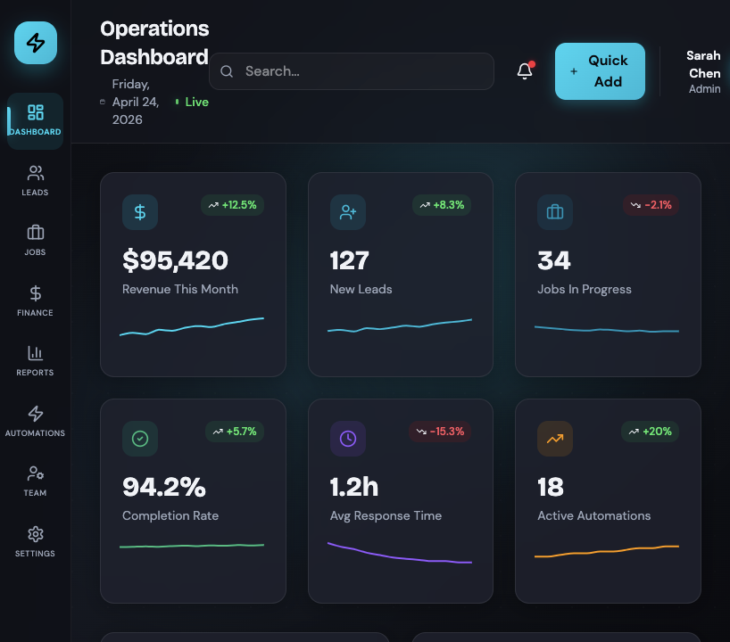

# Premium Custom Admin Dashboard

A premium, custom-built admin dashboard with advanced analytics and operational workflow visualization.

## Screenshot



## What This Project Includes

- KPI overview cards with trend indicators
- Revenue and lead-source visualizations
- Workflow board for operational status
- Automation cards with trigger/action summaries
- Activity feed for recent events
- Dark, gradient-first dashboard theme with subtle motion

## Tech Stack

- React 18 + TypeScript
- Vite 6
- Tailwind CSS v4 (via `@tailwindcss/vite`)
- Motion (`motion/react`) for animation
- Recharts for charting
- Radix UI-based component primitives

## Quick Start

### 1. Install dependencies

```bash
npm install
```

### 2. Start development server

```bash
npm run dev
```

### 3. Build for production

```bash
npm run build
```

## Project Structure

```text
.
├── assets
│   └── screenshots
│       └── operations-dashboard-full.png
├── src
│   ├── app
│   │   ├── App.tsx
│   │   └── components
│   │       ├── ActivityFeed.tsx
│   │       ├── AutomationCard.tsx
│   │       ├── Header.tsx
│   │       ├── KPICard.tsx
│   │       ├── LeadSourceChart.tsx
│   │       ├── RevenueChart.tsx
│   │       ├── Sidebar.tsx
│   │       ├── WorkflowBoard.tsx
│   │       ├── figma
│   │       └── ui
│   └── styles
│       ├── fonts.css
│       ├── index.css
│       ├── tailwind.css
│       └── theme.css
├── index.html
├── package.json
└── vite.config.ts
```

## Styling and Theming

- Global style entrypoint: `src/styles/index.css`
- Tailwind source scanning config: `src/styles/tailwind.css`
- Theme tokens and design variables: `src/styles/theme.css`
- The app uses CSS custom properties for color, spacing/radius, and typography.

## Notes

- A custom Vite plugin in `vite.config.ts` resolves `figma:asset/*` imports to `src/assets/*`.
- The repository includes `AGENTS.md` with implementation guidance for contributors/agents.
  
